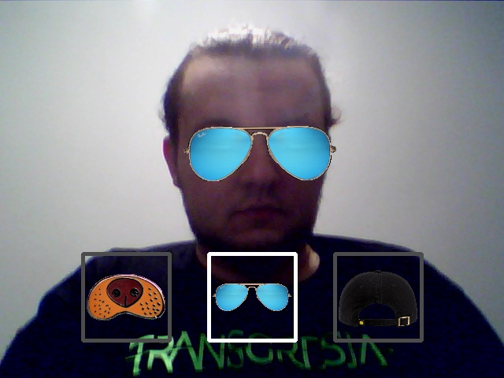

# Image/video filters

It is real-time video processor similar to snapchat or instagram.

First commit is based on https://codersdaily.in/blog/create-snapchat-filter-using-python with some fixes.

## Things need to do before first run:
1. Download model file and copy to models/: https://github.com/italojs/facial-landmarks-recognition/blob/master/shape_predictor_68_face_landmarks.dat 

## Project structure:
- src/ - all source files
- data/ - images used by filters - in separate catalogs
- models/ - saved models to use
- saved_images/ - output for images to save

## GUI and controls:

1. Middle segment is active filter - click on it to save image with filters effect.
2. Left/right segment - click on it to change filter to next/previous.
3. Click on anywhere else to change variant of filter (if possible).

## To do:
1. Change model to a better one (faster/resistant to poor lighting conditions/more detected points on face).
2. Optimize/change image blending algorithm.
3. Add new filters (for example "mask filter" that will fit detected points and imitate the behavior of the face).
4. Refactor camera and image processors into classes.
